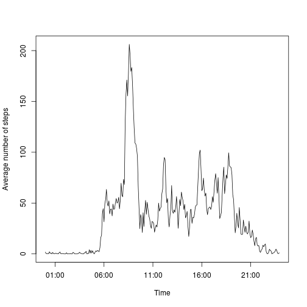

## Loading and preprocessing the data
Loading required libraries:

```r
library(dplyr)
library(lattice)
```

Loading activity data from zip file:

```r
activity <- read.csv(unz("activity.zip", "activity.csv"))
head(activity)
```

```
##   steps       date interval
## 1    NA 2012-10-01        0
## 2    NA 2012-10-01        5
## 3    NA 2012-10-01       10
## 4    NA 2012-10-01       15
## 5    NA 2012-10-01       20
## 6    NA 2012-10-01       25
```

## What is mean total number of steps taken per day?
Grouping activity data by day:

```r
by_date <- group_by(activity, date)
total_steps_daily <- summarise(by_date, total_steps = sum(steps, na.rm = TRUE))
head(total_steps_daily)
```

```
## Source: local data frame [6 x 2]
## 
##         date total_steps
## 1 2012-10-01           0
## 2 2012-10-02         126
## 3 2012-10-03       11352
## 4 2012-10-04       12116
## 5 2012-10-05       13294
## 6 2012-10-06       15420
```

Histogram for total number of steps per day;

```r
hist(
  total_steps_daily$total_steps, 
  main = "Histogram of total number of steps per day", 
  xlab = "Total number of steps daily"
)
```

 

Mean of total number of steps per day:

```r
mean(total_steps_daily$total_steps)
```

```
## [1] 9354.23
```

Median of total number of steps per day:

```r
median(total_steps_daily$total_steps)
```

```
## [1] 10395
```

## What is the average daily activity pattern?

Grouping data by interval:

```r
by_interval <- group_by(activity, interval)
mean_steps_per_interval <- summarise(by_interval, steps = mean(steps, na.rm = TRUE))
head(mean_steps_per_interval)
```

```
## Source: local data frame [6 x 2]
## 
##   interval     steps
## 1        0 1.7169811
## 2        5 0.3396226
## 3       10 0.1320755
## 4       15 0.1509434
## 5       20 0.0754717
## 6       25 2.0943396
```

Plotting average daily activity pattern:

```r
plot(
  strptime(formatC(mean_steps_per_interval$interval, width = 4, format = "d", flag = "0"), format = "%H%M"),
  mean_steps_per_interval$steps, type="l", 
  xlab="Time", 
  ylab="Average number of steps"
)
```

 

Calculating the index of interval with maximum number of steps,

```r
which.max(mean_steps_per_interval$steps)
```

```
## [1] 104
```

which is interval starting at 8:35:

```r
mean_steps_per_interval$interval[which.max(mean_steps_per_interval$steps)]
```

```
## [1] 835
```


## Imputing missing values

Calculating total count of ```NA``` values

```r
sum(is.na(activity$steps))
```

```
## [1] 2304
```

Adding column with values containing mean steps per interval:

```r
new_activity <- activity
new_activity$meancol <- mean_steps_per_interval$steps
head(new_activity)
```

```
##   steps       date interval   meancol
## 1    NA 2012-10-01        0 1.7169811
## 2    NA 2012-10-01        5 0.3396226
## 3    NA 2012-10-01       10 0.1320755
## 4    NA 2012-10-01       15 0.1509434
## 5    NA 2012-10-01       20 0.0754717
## 6    NA 2012-10-01       25 2.0943396
```

Filling ```NA```s with mean step number in given interval and selecting only original columns:

```r
new_activity <- mutate(new_activity, steps = ifelse(!is.na(steps), steps, meancol))
new_activity <- new_activity[,c("steps", "date", "interval")]
head(new_activity)
```

```
##       steps       date interval
## 1 1.7169811 2012-10-01        0
## 2 0.3396226 2012-10-01        5
## 3 0.1320755 2012-10-01       10
## 4 0.1509434 2012-10-01       15
## 5 0.0754717 2012-10-01       20
## 6 2.0943396 2012-10-01       25
```

Grouping activity data by day:

```r
new_by_date <- group_by(new_activity, date)
new_total_steps_daily <- summarise(new_by_date, total_steps = sum(steps, na.rm = TRUE))
head(new_total_steps_daily)
```

```
## Source: local data frame [6 x 2]
## 
##         date total_steps
## 1 2012-10-01    10766.19
## 2 2012-10-02      126.00
## 3 2012-10-03    11352.00
## 4 2012-10-04    12116.00
## 5 2012-10-05    13294.00
## 6 2012-10-06    15420.00
```

Histogram for total number of steps per day;

```r
hist(
  new_total_steps_daily$total_steps, 
  main = "Histogram of total number of steps per day", 
  xlab = "Total number of steps daily"
)
```

 

Mean of total number of steps per day:

```r
mean(new_total_steps_daily$total_steps)
```

```
## [1] 10766.19
```

Median of total number of steps per day:

```r
median(new_total_steps_daily$total_steps)
```

```
## [1] 10766.19
```

## Are there differences in activity patterns between weekdays and weekends?
Adding weekend/weekday information to dataset:

```r
new_activity$weekend_weekday <- ifelse(weekdays(strptime(new_activity$date, format = "%Y-%m-%d")) == "Sunday" | weekdays(strptime(new_activity$date, format = "%Y-%m-%d")) == "Saturday", "weekend", "weekday")
head(new_activity)
```

```
##       steps       date interval weekend_weekday
## 1 1.7169811 2012-10-01        0         weekday
## 2 0.3396226 2012-10-01        5         weekday
## 3 0.1320755 2012-10-01       10         weekday
## 4 0.1509434 2012-10-01       15         weekday
## 5 0.0754717 2012-10-01       20         weekday
## 6 2.0943396 2012-10-01       25         weekday
```

Computing mean steps for interval on weekends:

```r
weekend_data <- new_activity[new_activity$weekend_weekday == "weekend", ]
weekend_by_interval <- group_by(weekend_data, interval)
weekend_mean_steps_per_interval <- summarise(weekend_by_interval, steps = mean(steps))
weekend_mean_steps_per_interval$weekend_weekday <- "weekend"
head(weekend_mean_steps_per_interval)
```

```
## Source: local data frame [6 x 3]
## 
##   interval       steps weekend_weekday
## 1        0 0.214622642         weekend
## 2        5 0.042452830         weekend
## 3       10 0.016509434         weekend
## 4       15 0.018867925         weekend
## 5       20 0.009433962         weekend
## 6       25 3.511792453         weekend
```

Computing mean steps for interval on weekdays:

```r
weekday_data <- new_activity[new_activity$weekend_weekday == "weekday", ]
weekday_by_interval <- group_by(weekday_data, interval)
weekday_mean_steps_per_interval <- summarise(weekday_by_interval, steps = mean(steps))
weekday_mean_steps_per_interval$weekend_weekday <- "weekday"
head(weekday_mean_steps_per_interval)
```

```
## Source: local data frame [6 x 3]
## 
##   interval      steps weekend_weekday
## 1        0 2.25115304         weekday
## 2        5 0.44528302         weekday
## 3       10 0.17316562         weekday
## 4       15 0.19790356         weekday
## 5       20 0.09895178         weekday
## 6       25 1.59035639         weekday
```

Plotting weekend and weekday activity profiles:

```r
weekend_weekday_mean <- rbind(weekend_mean_steps_per_interval, weekday_mean_steps_per_interval)
print(xyplot(steps ~ interval | weekend_weekday, xlab = "interval", data=weekend_weekday_mean, type = "l",main = "Average Steps by Interval", layout=c(1,2)))
```

 
